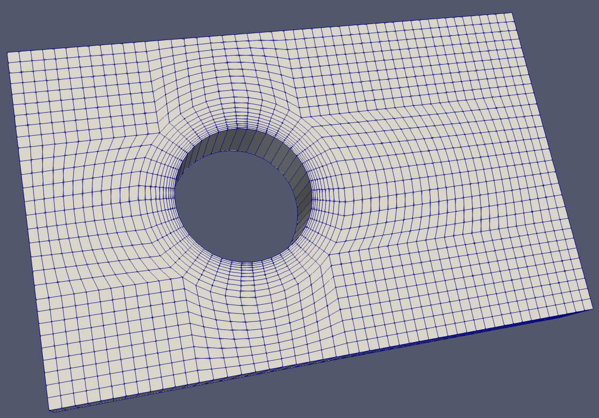
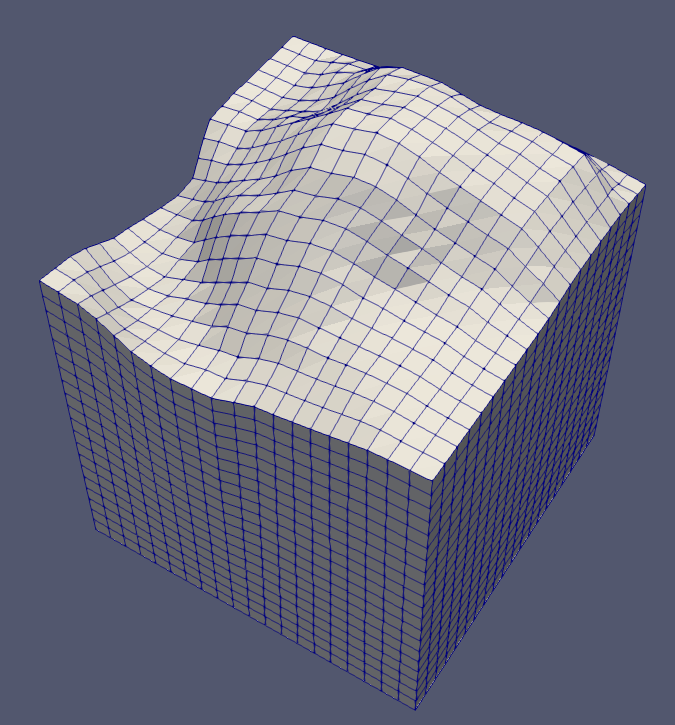

# classy_blocks


Python classes for easier creation of OpenFOAM's blockMesh dictionaries.

> Warning! This project is currently under development and is not yet very user-friendly. It still lacks some important features and probably features a lot of bugs. However, you're welcome to suggest features, improvements, and point out bugs.

# About
_blockMesh_ is a very powerful mesher but the amount of manual labour it requires to make even the simplest
meshes makes it mostly useless. Even attempts to simplify or parametrize blockMeshDicts with `#calc` or even
the dreadful `m4` quickly become unmanageable and cryptic.

classy_blocks' aim is to minimize the amount of meticulous work by providing a
more intuitive workflow, off-the-shelf parts and some automatic helpers for building and optimization of block-structured hexahedral meshes.
Still it is not an automatic mesher and therefore some kinds of geometry are more suited than others.

## Useful For
### Fields
- Turbomachinery (impellers, propellers)
- Microfluidics
- Flow around buildings
- Heat transfer (PCB models, heatsinks)
- Airfoils (2D)
- Solids (heat transfer, mechanical stresses)

### Cases
- Simpler rotational geometry (immersed rotors, mixers)
- Pipes/channels
- Tanks/plenums/containers
- External aerodynamics of blunt bodies
- Modeling thin geometry (seals, labyrinths)
- Parametric studies
- Background meshes for snappy (cylindrical, custom)
- 2D and axisymmetric cases
- Overset meshes

## Not Good For
- External aerodynamics of vehicles (too complex to mesh manually, without refinement generates too many cells)
- Complex geometry in general
- One-off simulations (use automatic meshers)

# How To Use It
- If you just need the `classy_blocks`, install them with: `pip install git+https://github.com/damogranlabs/classy_blocks.git`
- If you want to run examples, follow instructions in [EXAMPLES_README.md](EXAMPLES_README.md)
- If you want to contribute, follow instructions in [CONTRIBUTING.md](CONTRIBUTING.md)

# Features

## Workflow
As opposed to blockMesh, where the user is expected to manually enter pre-calculated vertices, edges, blocks and whatnot, classy_blocks tries to mimic procedural modeling of modern 3D CAD programs. Here, a Python script contains steps that describe geometry of blocks, their cell count, grading, patches and so on. At the end, the procedure is translated directly to blockMeshDict and no manual editing of the latter should be required.

## Building Elements
_Unchecked items are not implemented yet but are on a TODO list_

- [x] Manual definition of a Block with Vertices, Edges and Faces
- [x] Operations (Loft, Extrude, Revolve)
    - [x] Loft
    - [x] Extrude
    - [x] Revolve
    - [x] Wedge (a shortcut to Revolve for 2D axisymmetric cases)
- [x] Predefined Shapes
    - [x] Box (shortcut to Block aligned with coordinate system)
    - [x] Elbow (bent pipe of various diameters/cross-sections)
    - [x] Cone Frustum (truncated cone)
    - [x] Cylinder
    - [x] Ring (annulus)
    - [x] Hemisphere
    - [ ] Elbow wall (thickened shell of an Elbow)
    - [ ] Frustum wall
    - [ ] Hemisphere wall
- [ ] Predefined parametric Objects
    - [ ] T-joint (round pipes)
    - [ ] X-joint
    - [ ] N-joint (multiple pipes)
    - [ ] Box with hole

## Modifiers
After blocks have been placed, it is possible to create new geometry based on placed blocks or to modify them.

- [ ] Move Block's Vertex/Edge/Face
- [ ] Delete a Block created by a Shape or Object
- [x] Project Block's Vertex/Edge/Face
- [ ] Chain Block's face to generate a new block
- [x] Chain Shape's surface (top/bottom/outer) to generate a new Shape
- [ ] Join two Blocks by extending their Edges
- [ ] Offset Block's faces to form new Blocks for easier creation of layouts with boundary layers that don't propagate into domain
- [ ] Optimize Vertex positions

## Meshing specification
- [x] Simple definition of edges: a single point for circular, a list of points for a spline edge, name of geometry for projecting
- [x] Automatic calculation of cell count and grading by specifying any of a number of parameters (cell-to-cell expansionr atio, start cell width, end cell width, total expansion ratio)
- [ ] [Edge grading](https://www.openfoam.com/documentation/user-guide/4-mesh-generation-and-conversion/4.3-mesh-generation-with-the-blockmesh-utility#x13-450004.3.1.3) (separate specification for each edge)
- [x] Automatic propagation of grading and cell count from a single block to all connected blocks as required by blockMesh
- [x] Projections of vertices, edges and block faces to geometry (triangulated and [searchable surfaces](https://www.openfoam.com/documentation/guides/latest/doc/guide-meshing-snappyhexmesh-geometry.html#meshing-snappyhexmesh-searchable-objects))
- [x] Face merging as described by [blockMesh user guide](https://www.openfoam.com/documentation/user-guide/4-mesh-generation-and-conversion/4.3-mesh-generation-with-the-blockmesh-utility#x13-470004.3.2). Breaks the pure-hexahedral-mesh rule but can often save the day for trickier geometries. Automatic duplication of points on merged block faces
- [ ] Auto grading for Low-Re meshes: boundary layer with specified cell-to-cell expansion, transition with 2:1 expansion, and specified 'bulk' cell size

# Examples

## Shapes
A simple Cylinder:

```python
inlet = Cylinder([x_start, 0, 0], [x_end, 0, 0], [0, 0, radius])
inlet.chop_radial(count=n_cells_radial, end_size=boundary_layer_thickness)
inlet.chop_axial(start_size=axial_cell_size, end_size=2*axial_cell_size)
inlet.chop_tangential(count=n_cells_tangential)

inlet.set_bottom_patch('inlet')
inlet.set_outer_patch('wall')
inlet.set_top_patch('outlet')
mesh.add(inlet)
```

> See [examples/shape](https://github.com/damogranlabs/classy_examples) for use of each _shape_
> and [examples/complex](https://github.com/damogranlabs/classy_examples) for a more real-life example usage of shapes.

## Operations

Analogous to a sketch in 3D CAD software, a Face is a set of 4 vertices and 4 edges.
An _Operation_ is a 3D shape obtained by swiping a Face into 3rd dimension by a specified rule; an example of Revolve:

```python
# a quadrangle with one curved side
base = Face(
    [ # quad vertices
        [0, 0, 0],
        [1, 0, 0],
        [1, 1, 0],
        [0, 1, 0]
    ],
    [ # edges: None specifies straight edge
        [0.5, -0.2, 0], # single point: arc
        None,
        None,
        None
  ]
)

revolve = Revolve(
    base, # face to revolve
    f.deg2rad(45), # revolve angle
    [0, -1, 0], # axis
    [-2, 0, 0]  # origin
)

revolve.chop(0, count=15) # first edge
revolve.chop(1, count=15) # second edge
revolve.chop(2, start_size=0.05) # revolve direction
mesh.add(revolve)
```

> See [examples/operations](https://github.com/damogranlabs/classy_examples) for an example of each operation.

## Projection To Geometry

[Any geometry that snappyHexMesh understands](https://www.openfoam.com/documentation/guides/latest/doc/guide-meshing-snappyhexmesh-geometry.html)
is also supported by blockMesh.
That includes searchable surfaces such as spheres and cylinders and triangulated surfaces.

Projecting a block side to a geometry is straightforward; edges, however, can be projected to a single geometry (will 'snap' to the closest point) or to an intersection of two surfaces, which will define it exactly.

Geometry is specified as a simple dictionary of strings and is thrown in blockMeshDict exactly as provided by the user.


```python
geometry = {
    'terrain': [
        'type triSurfaceMesh',
        'name terrain',
        'file "terrain.stl"',
    ],
    'left_wall': [
        'type       searchablePlane',
        'planeType  pointAndNormal',
        'point      (-1 0 0)',
        'normal     (1  0  0)',
    ]
}

box = Box([-1., -1., -1.], [1., 1., 1.])
box.project_side('bottom', 'terrain')
box.project_edge(0, 1, 'terrain')
box.project_edge(3, 0, ['terrain', 'left_wall'])
```

## Face Merging

Simply provide names of patches to be merged and call `mesh.merge_patches(<master>, <slave>)`.
classy_blocks will take care of point duplication and whatnot.

```python
box = Box([-0.5, -0.5, 0], [0.5, 0.5, 1])
for i in range(3):
    box.chop(i, count=25)
box.set_patch('top', 'box_top')
mesh.add(box)

cylinder = Cylinder(
    [0, 0, 1],
    [0, 0, 2],
    [0.25, 0, 1]
)
cylinder.chop_axial(count=10)
cylinder.chop_radial(count=10)
cylinder.chop_tangential(count=20)

cylinder.set_bottom_patch('cylinder_bottom')
mesh.add(cylinder)

mesh.merge_patches('box_top', 'cylinder_bottom')
```

## Chaining and expanding/contracting

Useful for Shapes, mostly for piping and rotational geometry; An existing Shape's start or end sketch can be reused as a
starting sketch for a new Shape, as long as they are compatible.
For instance, an `Elbow` can be _chained_ to a `Cylinder` just like joining pipes in plumbing.

Moreover, most shapes* can be expanded to form a _wall_ version of the same shape. For instance, expanding a `Cylinder`
creates an `ExtrudedRing`.

> See [examples/chaining](https://github.com/damogranlabs/classy_examples) for an example of each operation.

## Debugging

By default, a `debug.vtk` file is created where each block represents a hexahedral cell.
By showing `block_ids` with a proper color scale the blocking can be visualized.
This is useful when blockMesh fails with errors reporting invalid/inside-out blocks but VTK will
happily show anything.

## Showcase

These are some screenshots of parametric models, built with classy_blocks.

Rectangular ducts (Extrude and Revolve Operations)


3D pipes with twists and turns (chained Elbow and Cylinder Shapes)


A simple tank with rounded edges


A flywheel in a case. VTK Blocking output for debug is shown in the middle


Venturi tube


2D mesh for studying Karman Vortex Street


Helmholtz nozzle, a resonator with sharp edges. See [this sketch](https://www.researchgate.net/figure/Schematic-diagram-of-a-Helmholtz-oscillator-and-its-operating-principles_fig6_305275686).


Edges and faces, projected to an STL surface


Mesh for studying flow around a sphere, with projected edges and faces


A parametric, Low-Re mesh of a real-life impeller *(not included in examples)*


# Prerequisites

Package (python) dependencies can be found in *setup.py* file.
Other dependencies that must be installed:
- python3.7 and higher
- OpenFoam: .org or .com version is supported, foam-extend's blockMesh doesn't support multigrading but is otherwise also compatible.

# Technical Information

There's no official documentation yet so here are some tips for easier navigation through source.

## The Process, Roughly

1. User writes a script that defines operations/shapes/objects, their edges, projections, cell counts, whatever is needed.
1. All the stuff is added to mesh.
1. Mesh converts user entered data into vertices, blocks, edges and whatnot. 
1. The mesh can be written at that point; or,
1. Modification of placed geometry, either by manually moving vertices or by utilizing some sort of optimization algorithm.
1. Output of optimized/modified mesh.

# TODO
- Unchecked list items from [Features](#features)
- Usability
    - Frustum with any profile, not just arc
- Chaining:
    - *FrustumWall.expand()
    - *FrustumWall.contract()
    - *ElbowWall.contract()
    - Box.chain()
    - Block.chain() (low-level), or Block.get_face() -> Face
- Manual modification, automatic optimization
- Examples
    - Ramjet engine
- Technical stuff:
    - Skew transform
    - Debugging: connection between block and Shapes, naming
    - More tests
    - Documentation